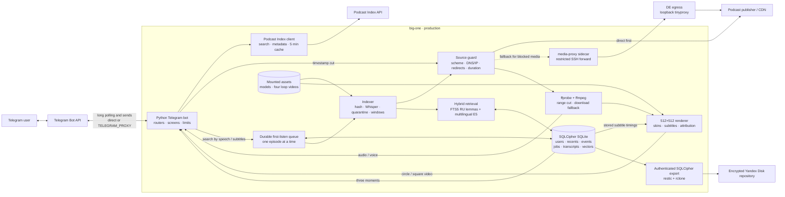

# Podcast Cutter architecture

Current as of 2026-08-26. This is the presentation-sized system map; the
operator details live in `README.md`, `HANDOFF.md`, `deploy/README.md` and
`docs/backup-policy.md`.

## The five paths to explain in a demo

1. **Find an episode.** Telegram input goes through the screen/router layer to
   Podcast Index. Directory metadata is cached only when the response permits
   it.
2. **Cut a known moment.** The source is validated, probed and cut by HTTP
   range where possible. A verified local-download/re-encode path catches
   hostile sources and codecs.
3. **Find a moment by speech.** The durable queue fetches and hashes the real
   episode bytes, Whisper produces timed utterances, suspicious spans are
   quarantined, and lexical plus semantic retrieval returns three moments.
4. **Make it shareable.** The same audio can leave as audio, a voice message,
   a round video note or a square video. Video rendering adds the selected
   skin, optional subtitles, source context and `@podcast_cutter_bot`.
5. **Survive failure.** SQLCipher holds the expensive and personal state;
   authenticated exports go into encrypted off-host backups. The media tunnel
   is fallback-only, so its failure does not take working direct sources down.

## Boundaries that are deliberate

- Podcast Index and Telegram are not sent through the media detour. Only
  publisher audio uses it when direct fetching fails.
- Audio is temporary; transcripts and their search index are durable. Loop
  videos and model weights are replaceable mounted assets, not database rows.
- A queue item is an episode, not a person: ten people waiting for the same
  episode share one transcription.
- Session screens are intentionally in memory. After a restart the expensive
  transcription resumes and the user receives a deep link back to the episode;
  a stale interaction screen is not reconstructed.
- The bot can record that a tagged visitor made a successful cut, but Telegram
  does not tell bots whether the resulting file was forwarded. “Shared” must
  therefore be learned from user feedback, not claimed as an analytics event.

## Deployment shape

- `podcast-cutter` is the only application container and is pinned to eight
  physical cores for local ASR.
- `podcast-cutter-tunnel` is an independently restartable optional sidecar.
- `/data` is the persistent volume; `/data/brainrot` is a read-only host mount.
- The backup container runs only from systemd-driven scripts and never owns the
  Docker socket.
- Production deploys must name the service:
  `docker compose up -d --build --no-deps podcast-cutter`. This leaves the
  healthy tunnel untouched.
